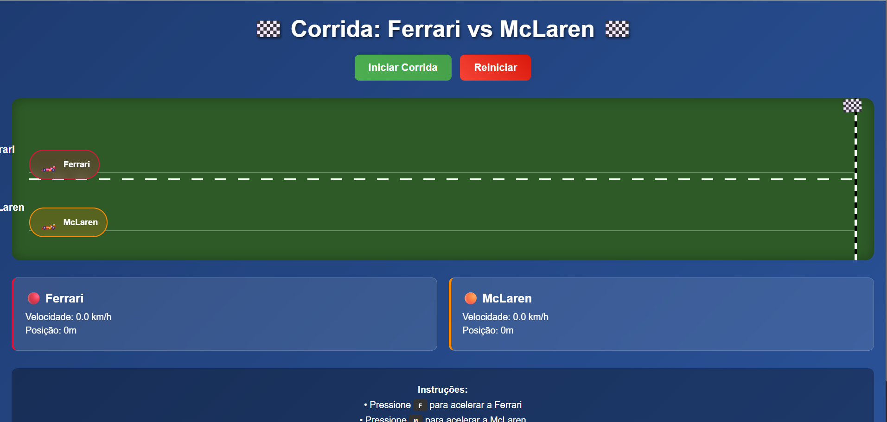

# 🏁 Car Race Game - Angular Study Project

An interactive car racing game developed in **Angular 20** for framework study and practice. This project demonstrates fundamental Angular concepts such as standalone components, data binding, event handling, lifecycle hooks, and CSS animations.

## 🖼️ Game Preview:


## 🎮 About the Project

This is a racing game where two cars (Ferrari and McLaren) compete on a virtual track. Players can control the cars' speed using the keyboard, creating an interactive and fun experience.

### ✨ Features

- **Interactive Racing**: Control cars in real-time
- **Keyboard Controls**: Use F and M keys to accelerate
- **CSS Animations**: Smooth and responsive visual effects
- **Modern Interface**: Design with gradients and glassmorphism effects
- **Real-time Statistics**: Track car speed and position
- **Victory System**: Automatic winner detection
- **Responsive**: Works on desktop and mobile devices

## 🛠️ Technologies Used

- **Angular 20** - Main framework
- **TypeScript** - Programming language
- **CSS3** - Styling with animations and gradients
- **HTML5** - Application structure
- **Angular CLI** - Development tools

## 📋 Prerequisites

Before running this project, make sure you have installed:

- **Node.js** (version 18 or higher)
- **npm** (Node.js package manager)
- **Angular CLI** (optional, but recommended)

### How to install prerequisites:

1. **Node.js**: Download and install from [nodejs.org](https://nodejs.org/)
2. **npm**: Comes with Node.js
3. **Angular CLI** (optional):
   ```bash
   npm install -g @angular/cli
   ```

## 🚀 How to Download and Run the Project

### 1. Clone the Repository

```bash
git clone https://github.com/your-username/car-race.git
cd car-race
```

### 2. Install Dependencies

```bash
npm install
```

### 3. Run the Project

```bash
npm start
```

Or if you have Angular CLI installed globally:

```bash
ng serve
```

### 4. Access the Application

Open your browser and go to: `http://localhost:4200`

## 🎯 How to Play

1. **Start the Race**: Click the "Start Race" button
2. **Control Ferrari**: Press the **F** key to accelerate
3. **Control McLaren**: Press the **M** key to accelerate
4. **Reset**: Use the "Reset" button to start a new race

### 🏆 Objective

The first car to reach the finish line (checkered flag) wins the race!

## 📁 Project Structure

```
car-race/
├── src/
│   ├── main.ts          # Application entry point
│   ├── index.html       # Main HTML template
│   └── styles.css       # Global styles
├── angular.json         # Angular configuration
├── package.json         # Project dependencies
├── tsconfig.json        # TypeScript configuration
└── README.md           # This file
```

## 🔧 Useful Commands

### Development
```bash
npm start          # Start development server
npm run build      # Build project for production
npm run serve      # Alias for npm start
```

### Build and Deploy
```bash
npm run build      # Generate production files
npm run build --prod  # Optimized production build
```

## 🎨 Technical Features

### Main Component (`App`)
- **Standalone Component**: Uses Angular 20's new standalone architecture
- **Lifecycle Hooks**: Implements `OnInit` and `OnDestroy`
- **Event Handling**: Captures keyboard events with `@HostListener`
- **Data Binding**: Uses interpolation and property binding

### Interface and Styles
- **CSS Grid and Flexbox**: Responsive layout
- **CSS Gradients**: Modern visual effects
- **CSS Animations**: Smooth transitions and keyframes
- **Glassmorphism**: Frosted glass effect
- **Media Queries**: Responsive design for mobile

### Game Logic
- **Game Loop**: Continuous updates with `setInterval`
- **Simple Physics**: Acceleration, deceleration, and resistance
- **Randomness**: Speed variation to make the game more interesting
- **Victory Detection**: Automatic end-game system

## 🐛 Troubleshooting

### Error: "ng is not recognized"
```bash
npx ng serve
```

### Error: "Port 4200 is already in use"
```bash
ng serve --port 4201
```

### Error: "Dependencies not found"
```bash
npm install
rm -rf node_modules package-lock.json
npm install
```

## 📚 Angular Concepts Demonstrated

This project is excellent for learning:

- ✅ **Standalone Components** - Angular 20's new architecture
- ✅ **Data Binding** - Interpolation and property binding
- ✅ **Event Binding** - Keyboard and click event capture
- ✅ **Lifecycle Hooks** - OnInit and OnDestroy
- ✅ **Host Listeners** - DOM event listening
- ✅ **CSS-in-JS** - Encapsulated component styles
- ✅ **TypeScript** - Interfaces and typing
- ✅ **Bootstrap Application** - Standalone initialization

## 🤝 Contributing

Contributions are welcome! To contribute:

1. Fork the project
2. Create a feature branch (`git checkout -b feature/AmazingFeature`)
3. Commit your changes (`git commit -m 'Add some AmazingFeature'`)
4. Push to the branch (`git push origin feature/AmazingFeature`)
5. Open a Pull Request

## 📄 License

This project is under the MIT license. See the `LICENSE` file for more details.

## 👨‍💻 Author

Developed as an Angular framework study project.

---

**Have fun playing! 🏎️💨**

